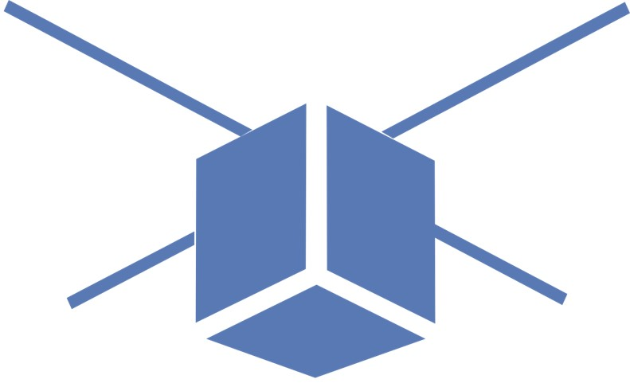

# Systems Engineering Introduction 

## Authors
- Marc Budinger (marc.budinger@insa-toulouse.fr)

## Course Description

### Objectives
Mechatronic and aerospace systems are highly complex systems that often have to meet specific and severe requirements depending of the application. 

### Content
Introduction to:
- Requirements analysis and preliminary design
- Dynamic modeling and identification 
- Numerical control 

### Study case
The course will focus on the thermal control of a nanosatellite battery. 

## Tools:
- Course website (https://sizinglab.github.io/SystemsEngineeringIntroduction/)
- Course Github repository (https://github.com/SizingLab/SystemsEngineeringIntroduction)
- Python (Jupyter Notebooks)

